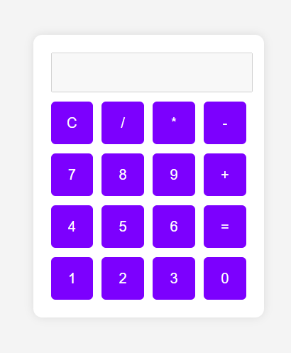
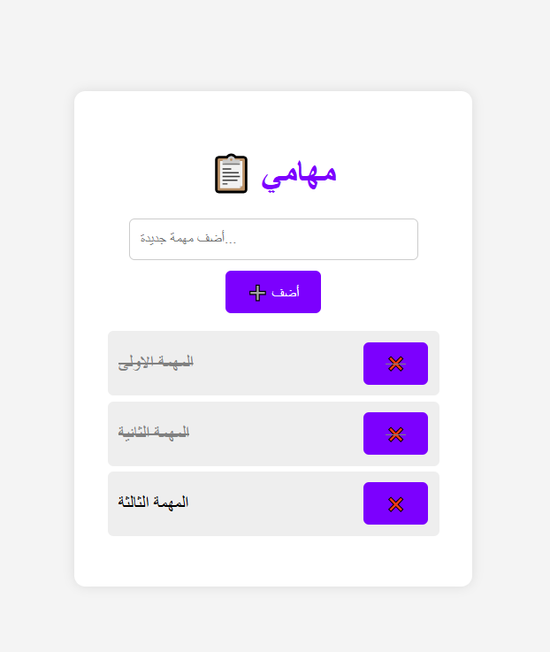

# 🌟 Simple Web Projects for Beginners

مرحبًا بك في مستودعي الخاص بالمشاريع البسيطة لتعلّم تطوير الويب! 👩‍💻👨‍💻  
هنا ستجد مشاريع تعليمية مصممة للمبتدئين خطوة بخطوة باستخدام HTML, CSS, وJavaScript.

---

## 📁 المشاريع المتوفرة:

### ✅ 1. آلة حاسبة بسيطة (Simple Calculator)
🖼️ 
- مشروع يساعدك على فهم أساسيات الأحداث (Events) والدوال (Functions).
- الميزات:
  - واجهة تفاعلية
  - عمليات حسابية بدون استخدام `eval`
  - تصميم جميل بلون بنفسجي 💜

📂 الملفات:
- `index.html`
- `style.css`
- `script.js`

---

### 📝 2. قائمة المهام (To-Do List)
🖼️ 
- مشروع لإدارة المهام اليومية.
- الميزات:
  - إضافة وحذف المهام
  - تعليم المهمة كمكتملة
  - حفظ المهام باستخدام `localStorage`

📂 الملفات:
- `index.html`
- `style.css`
- `script.js`

---

## 🎯 الهدف من هذا المستودع:
تعليم المفاهيم الأساسية في تطوير الويب بطريقة عملية وبسيطة جدًا.  
المشاريع هنا مخصصة لكل من بدأ رحلته في عالم البرمجة ويريد تطبيق ما يتعلمه بخطوات صغيرة.

---

## 🧠 كيف تستخدم هذه المشاريع؟

1. قم بتحميل الملفات أو استنساخ المستودع:
```bash
git clone https://github.com/your-username/simple-projects.git
